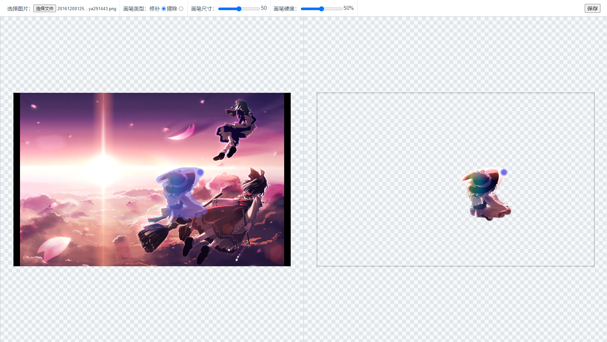
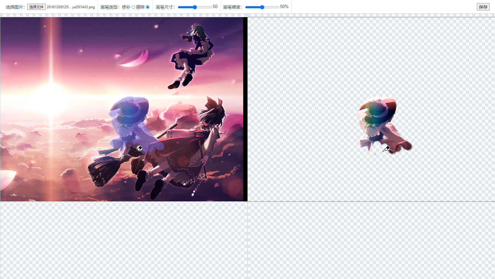
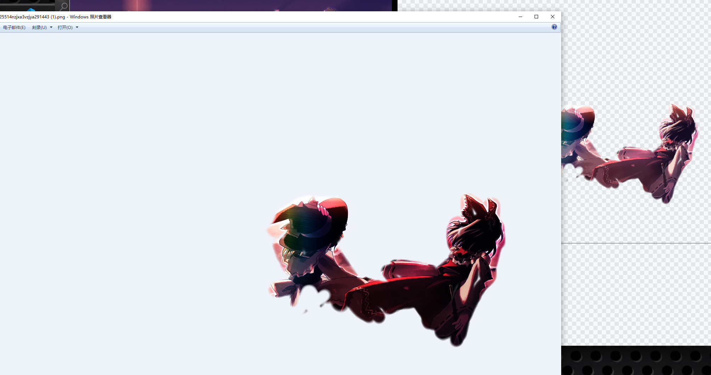

# 抠图编辑器demo

参考稿定设计智能抠图的擦补画笔实现的抠图编辑器demo，主要实现了擦除画笔和修补画笔，此外也包含图像拖动、缩放、保存等功能。

## 操作说明

这里是[demo地址](https://corleone113.github.io/my-matting/)，下面说明一下主要的功能。
- 修补画笔: 如下图所示，当选择完图片后，选择修补画笔(默认画笔类型)，在左侧操作画布上按下鼠标左键进行绘制(滑动)，就可以将绘制出的区域部分的图像修补到右侧结果画布上，所以修补画笔的实际效果就是抠图，并且左侧操作画布上的修补区域会有一层蒙版效果以显示已修补(抠出)的区域。
	
- 擦除画笔: 效果和修补画笔正好相反，可以对已修补部分的图像进行擦除。
	
- 画笔尺寸: 单位为px，默认为50px，但是受缩放比例值影响，比如缩放比例为50%，那么实际的画笔尺寸为25px。
- 画笔硬度: 相当于给修补/擦除画笔绘制的圆点区域的边缘添加一个羽化效果，而画笔硬度相当于羽化半径，硬度越小则羽化半径越大，反之则越小。
- 保存: 基于图像原始尺寸进行抠图操作并生成结果图像，图像越大保存过程越长。
	

## 其他说明
- 缩放功能: 滚动鼠标滚轮可以对两侧图像进行实时缩放，且缩放是以当前鼠标指针位置为中心进行的。
- 拖动功能: 在右侧结果画布上按下鼠标左键进行滑动可以对两侧图像进行拖动。
- 缩放/拖动限制: 缩放的范围为15%-1000%，拖动没有范围限制。
